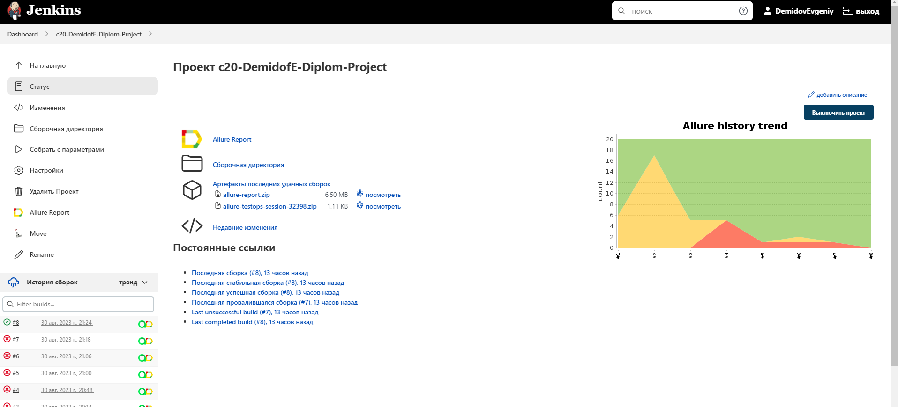
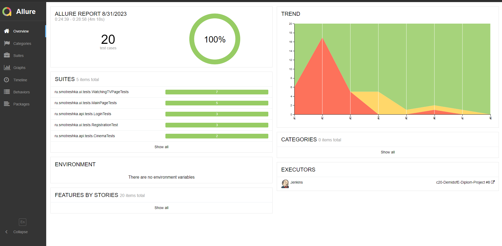
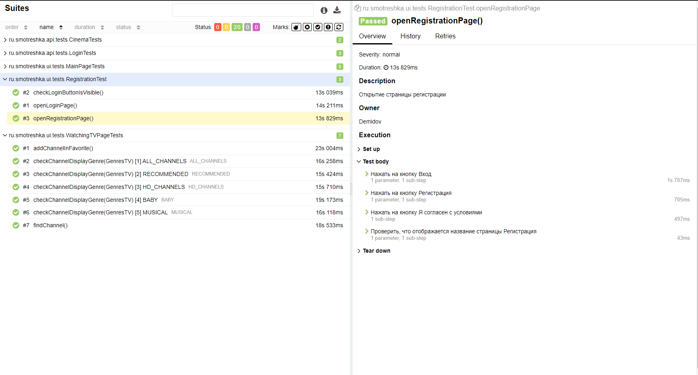
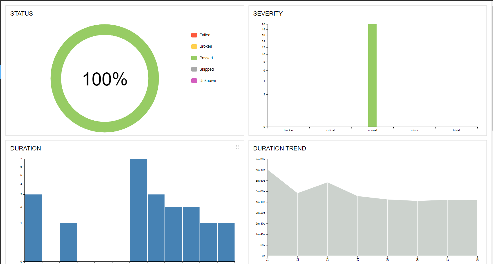
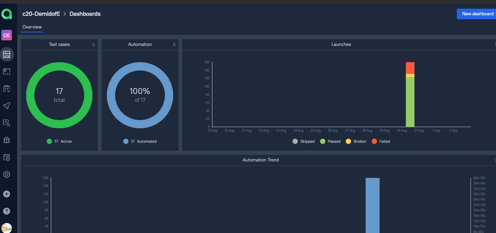
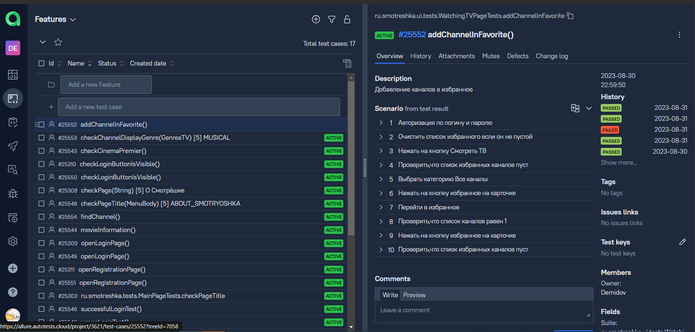
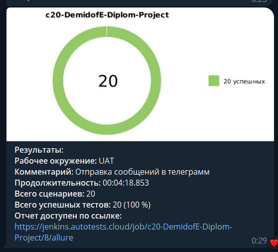
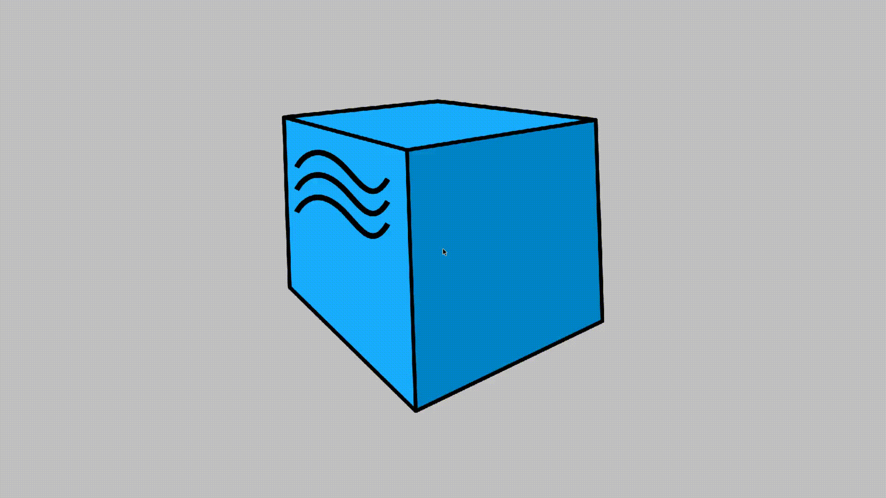

# Проект по автоматизации тестирования для компании [ЛАЙФСТРИМ](https://smotreshka.tv/)

> ЛАЙФСТРИМ — разрабатывает качественные решения для интернет-телевидения и онлайн-кинотеатров.

## **Содержание:**

____

* <a href="#tools">Технологии и инструменты</a>

* <a href="#cases">Примеры автоматизированных тест-кейсов</a>

* <a href="#jenkins">Сборка в Jenkins</a>

* <a href="#console">Запуск из терминала</a>

* <a href="#allure">Allure отчет</a>

* <a href="#allure_testops">Allure_testops отчет</a>

* <a href="#telegram">Уведомление в Telegram при помощи бота</a>

* <a href="#video">Примеры видео выполнения тестов на Selenoid</a>


____
<a id="tools"></a>

## <a name="Технологии и инструменты">**Технологии и инструменты:**</a>

<p align="center">  
<a href="https://www.jetbrains.com/idea/"></a>  
<a href="https://www.java.com/"></a>  
<a href="https://github.com/"></a>  
<a href="https://junit.org/junit5/"></a>  
<a href="https://gradle.org/"></a>  
<a href="https://selenide.org/"></a>
<a href="https://qameta.io/"></a>   
<a href="https://www.jenkins.io/"></a>  
<a href="https://www.jenkins.io/"></a>  
</p>

____
<a id="cases"></a>

## <a name="Примеры автоматизированных тест-кейсов">**Примеры автоматизированных тест-кейсов:**</a>

____

- ✓ *Проверка перехода на страницу авторизации*
- ✓ *Проверка перехода на страницу регисрации*
- ✓ *Проверка перехода на страницу Смотреть ТВ*
- ✓ *Проверка перехода на страницу Кино*
- ✓ *Проверка перехода на страницу Кинотеатр*
- ✓ *Проверка перехода на страницу На Smart TV*
- ✓ *Проверка перехода на страницу О Смотрёшке*
- ✓ *Добавление каналов в избранное*
- ✓ *Поиск каналов*
- ✓ *Проверка данных полученных по API*

____
<a id="jenkins"></a>

## </a><a name="Сборка"></a>Сборка в [Jenkins](https://jenkins.autotests.cloud/job/c20-DemidofE-lesson15-my-test-project/)</a>

____
<p align="center">  
<a href="https://jenkins.autotests.cloud/job/c20-DemidofE-Diplom-Project/"></a>  
</p>

### **Параметры сборки в Jenkins:**

- *browser (браузер, по умолчанию chrome)*
- *browserVersion (версия браузера, по умолчанию 100.0)*
- *browserSize (размер окна браузера, по умолчанию 1920x1080)*
- *baseUrl (адрес тестируемого веб-сайта)*
- *remoteUrl (логин, пароль и адрес удаленного сервера Selenoid)*

<a id="console"></a>

## Команды для запуска из терминала

___
***Локальный запуск:***
(Для запуска необходимо зарегистироваться на https://smotreshka.tv/)

```bash  
gradle clean test -Demail={EMAIL} -Dpassword={PASSWORD}
```

***Удалённый запуск с параметрами***

```bash  
clean {TASK}
"-DurlApi=${URL_API}"
"-DisRemote=true"
"-DbaseUrl=${BASE_URL}"
"-DbrowserSize=${BROWSER_SIZE}"
"-Dbrowser=${BROWSER}"
"-Dselenoid=${SELENOID}"
"-DbrowserVersion=${BROWSER_VERSION}"
```

***Параметры запуска:***

* <code>TASK</code> – Запускаемые автотесты (ui,api,test).
* <code>BASE_URL</code> – Url, по которому будет открываться тестируемое приложение.
* <code>BROWSER_SIZE</code> – размер окна браузера, в котором будут выполняться тесты. По-умолчанию - <code>
  1920x1080</code>.
* <code>BROWSER</code> – браузер, в котором будут выполняться тесты. По-умолчанию - <code>chrome</code>.
* <code>SELENOID</code> – адрес удаленного сервера, на котором будут запускаться тесты.
* <code>BROWSER_VERSION</code> – версия браузера, в которой будут выполняться тесты. По-умолчанию - <code>100.0</code>.
* <code>URL_API</code> - url для API запросов

___
<a id="allure"></a>

## </a> <a name="Allure"></a>Allure [отчет](https://jenkins.autotests.cloud/job/c20-DemidofE-Diplom-Project/8/allure/)</a>

___

### *Основная страница отчёта*

<p align="center">  
  
</p>  

### *Тест-кейсы*

<p align="center">  
  
</p>

### *Графики*

  <p align="center">  


</p>

___
<a id="allure_testops"></a>

## </a> <a name="Интеграция с Allure TestOps"></a>Интеграция с Allure TestOps [Dashboard](https://allure.autotests.cloud/project/3621/dashboards)</a>

#### Dashboard
<p align="center">

</p>

#### Тест-кейсы в Allure TestOps
<p align="center">

</p>
____
<a id="telegram"></a>

## </a> Уведомление в Telegram при помощи бота

____
<p align="center">  
  
</p>


____
<a id="video"></a>

## </a> Примеры видео выполнения тестов на Selenoid

____
<p align="center">
   
</p>

